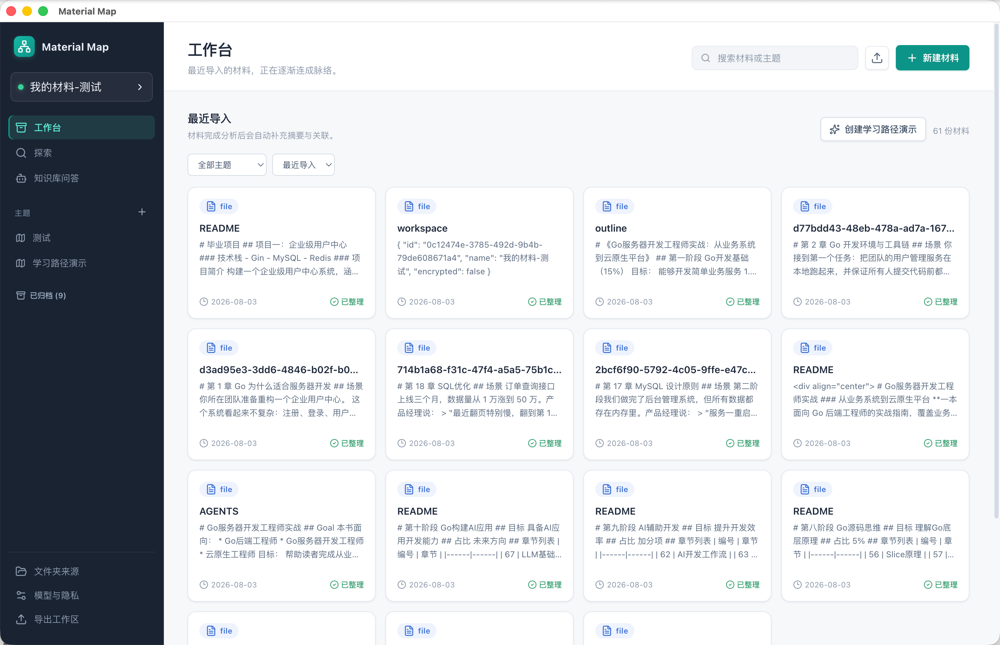
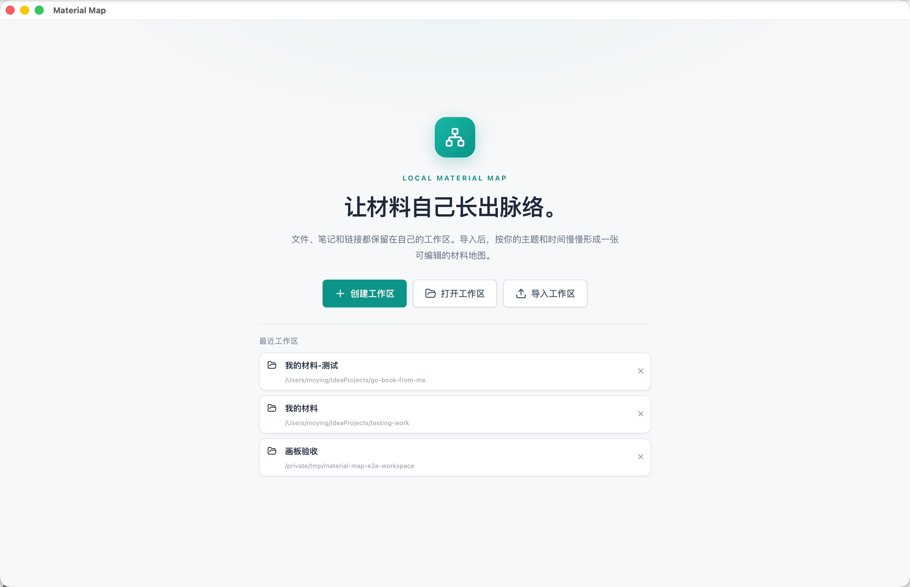
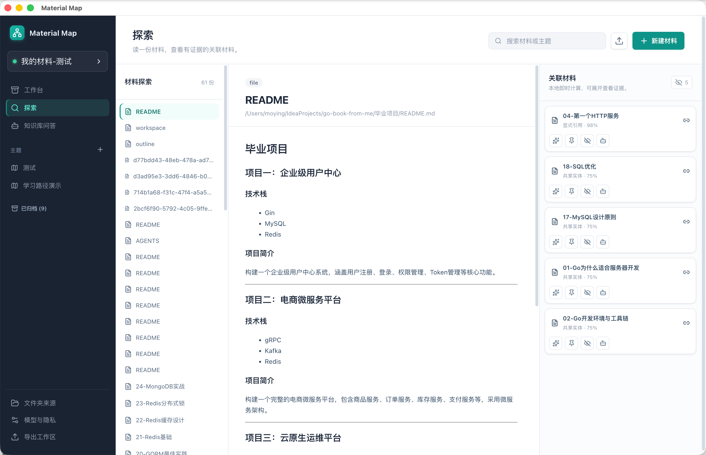
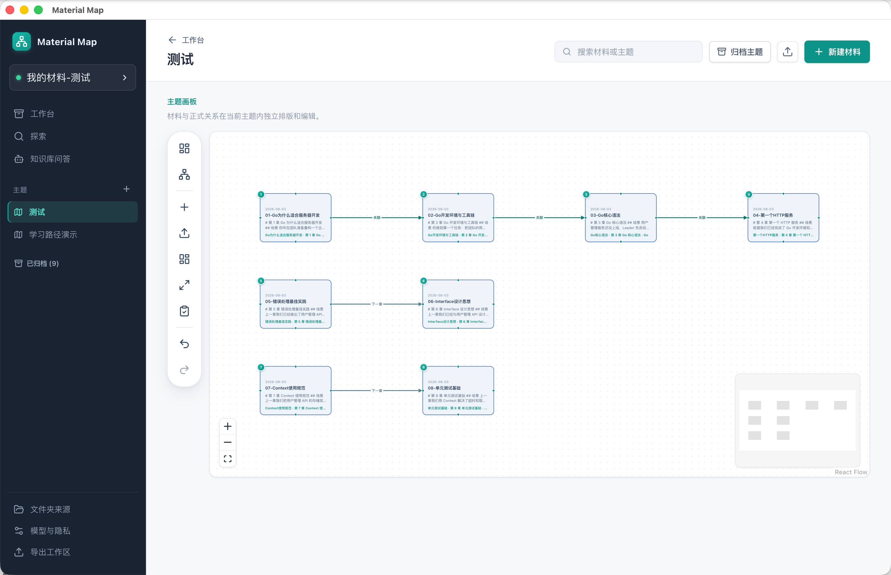
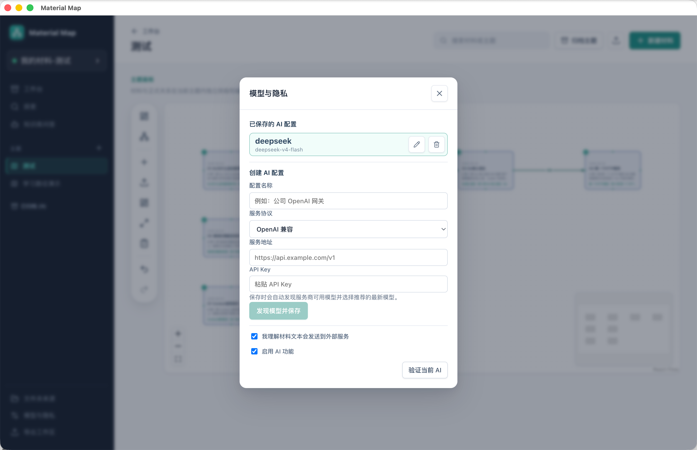
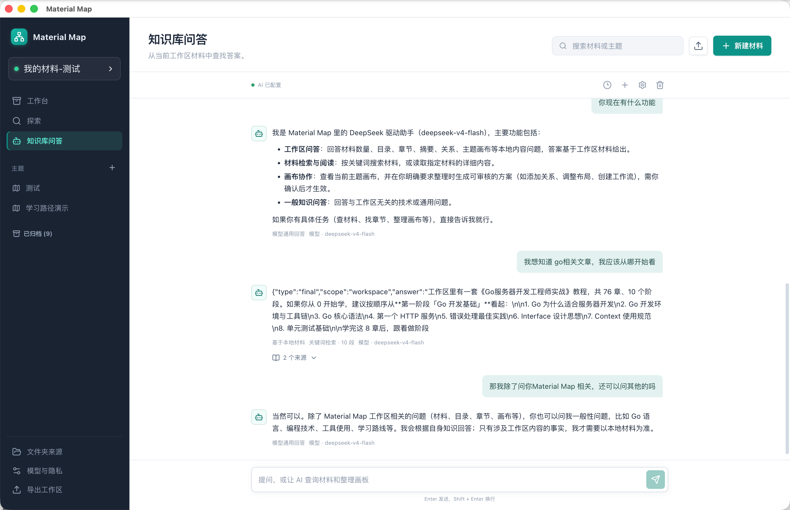
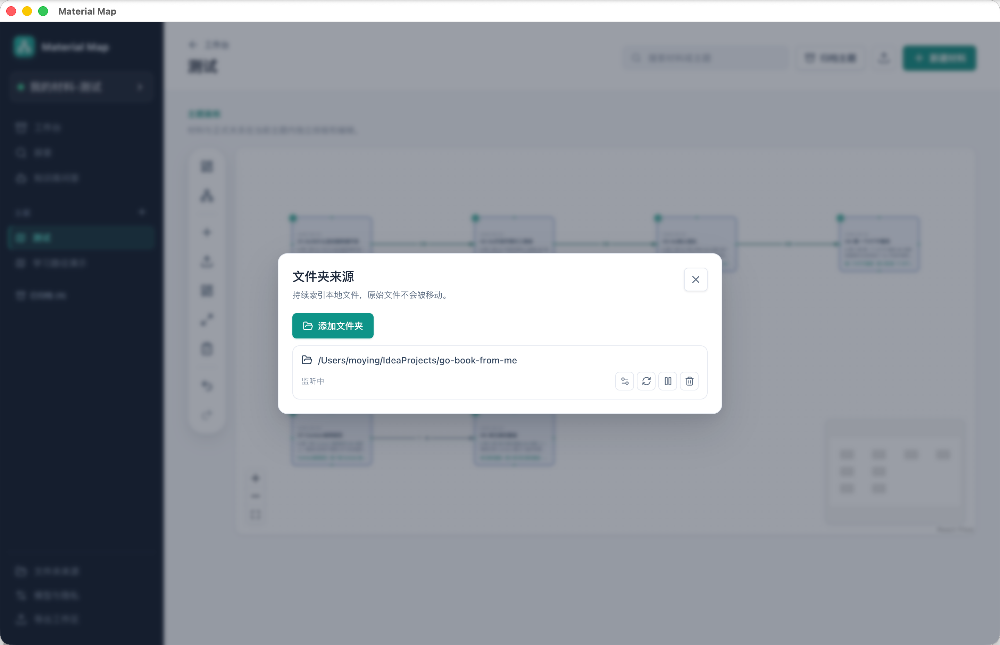
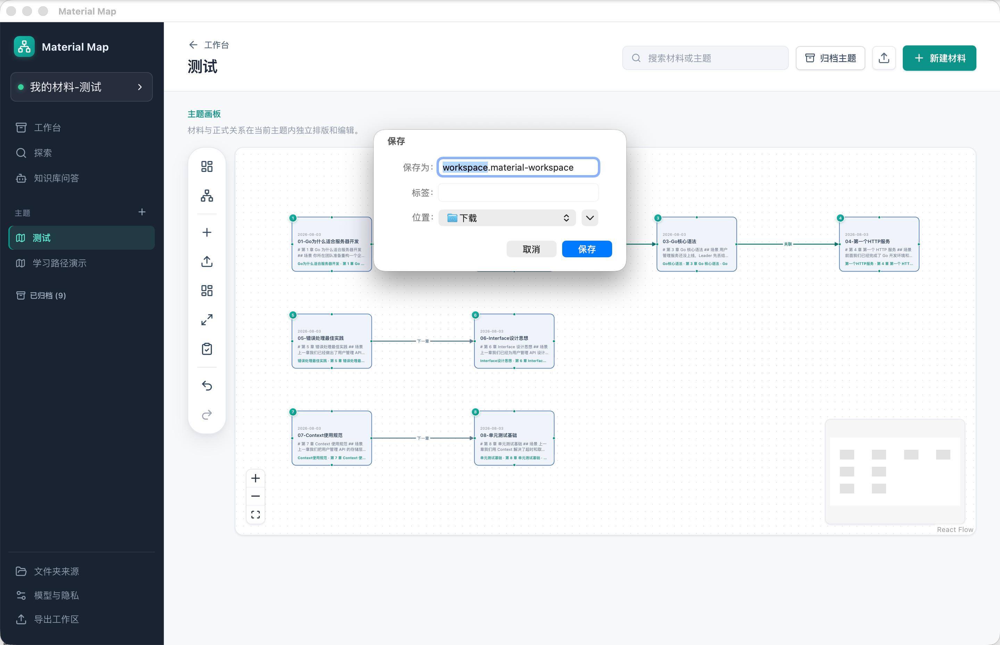

<p align="center">
  
</p>

<h1 align="center">Material Map</h1>

<p align="center">
  <strong>让本地材料自己长出脉络。</strong><br />
  将文件、笔记和链接留在自己的工作区，导入后按主题和证据形成可编辑的材料地图。
</p>

<p align="center">
  <a href="https://github.com/dongdonglog/Auto-connect-project/releases/latest"></a>
  <a href="https://github.com/dongdonglog/Auto-connect-project/actions/workflows/windows-package.yml"></a>
  <a href="./LICENSE"></a>
  <a href="./README-EN.md">English</a>
</p>

<p align="center">
  
</p>

## 这是什么

Material Map 是一个本地优先的桌面材料地图和小型知识库。它把材料导入、全文检索、可解释关联、主题画板和可选 AI 问答放在同一个工作区里。

它适合整理技术文档、项目资料、学习笔记和个人文件。原始文件仍由你管理；工作区保存索引、摘要、关系、主题布局和导出数据。AI 默认关闭，只有你主动配置并发送问题时才会接收本次请求所需的材料上下文。

## 下载

当前稳定版本：[v1.0.0 Release](https://github.com/dongdonglog/Auto-connect-project/releases/tag/v1.0.0)

| 平台 | 产物 | 适用场景 |
| --- | --- | --- |
| Windows x64 | [安装版](https://github.com/dongdonglog/Auto-connect-project/releases/download/v1.0.0/Material.Map.Setup.1.0.0.exe) · [Portable](https://github.com/dongdonglog/Auto-connect-project/releases/download/v1.0.0/Material.Map.1.0.0.exe) | Intel / AMD Windows 10/11 |
| macOS arm64 | [DMG](https://github.com/dongdonglog/Auto-connect-project/releases/download/v1.0.0/Material.Map-1.0.0-arm64.dmg) · [ZIP](https://github.com/dongdonglog/Auto-connect-project/releases/download/v1.0.0/Material.Map-1.0.0-arm64-mac.zip) | Apple Silicon（M 系列） |

macOS 首次打开若出现安全提示，请在“系统设置 → 隐私与安全性”中允许打开。当前安装包没有 Apple Developer ID 签名和公证。

## 核心能力

- **本地工作区**：创建、打开、加密、导出和恢复工作区，原始文件不被应用移动。
- **材料管理**：导入 Markdown、TXT、CSV、JSON、HTML、PDF、DOCX，或直接创建笔记、文档和链接。
- **关系探索**：从材料中发现显式引用、共享实体和结构邻近关系，每条关联都可以展开证据。
- **主题画板**：将材料固定到主题中，创建单向正式关系，编辑卡片样式、路径、箭头和布局。
- **可选 AI**：接入 DeepSeek、OpenAI 兼容服务、Ollama、Anthropic 或 Gemini，回答材料问题并显示模型与来源。
- **Agent / MCP**：AI 可以按问题查询材料、关系和主题；涉及画板修改时只生成待审核提案。

## 完整操作流程

下面的流程对应当前应用界面。图片均为实际应用截图，路径使用仓库内的相对地址，克隆仓库后也可以正常查看。

### 1. 创建或打开工作区

启动应用后进入欢迎页：

1. 点击“创建工作区”，选择一个本地目录并填写工作区名称。
2. 如需保护工作区，勾选“加密本地工作区”，设置至少 8 位密码。
3. 已有工作区使用“打开工作区”。
4. `.material-workspace` 导出包使用“导入工作区”恢复。
5. 最近打开过的工作区会显示在欢迎页，可直接重新打开。

<p align="center">
  
</p>

### 2. 导入材料

进入“工作台”后，点击右上角“导入文件”，选择一个或多个文件。当前支持 Markdown、TXT、CSV、JSON、HTML、PDF 和 DOCX。

也可以点击“新建材料”创建笔记、Markdown、TXT、CSV、JSON 或 HTML，或者点击“添加链接”输入 `http://` / `https://` 地址。导入后等待解析和索引任务完成，材料卡片会显示标题、类型、摘要、日期和处理状态。

<p align="center">
  
</p>

### 3. 管理材料

在工作台可以：

- 搜索材料或主题。
- 按“最近导入”或“按主题”排序筛选。
- 点击卡片阅读材料详情。
- 编辑文本类材料的标题和内容。
- 修改日期、加入主题或进入“探索”。
- 在材料菜单中删除工作区记录。

删除材料只删除当前工作区中的材料记录，不会删除原始导入文件。

### 4. 探索材料关系

点击侧边栏“探索”，进入三栏视图：左侧选择材料，中间阅读原文，右侧查看关联材料。

1. 点击右侧关联卡片查看目标材料。
2. 点击证据按钮展开原文片段。
3. 点击证据来源跳转到阅读器中的原文位置。
4. 使用眼睛按钮隐藏或恢复一条关联。
5. 使用图钉按钮将关系固定到已有主题或新建主题。
6. AI 配置完成后，可以请求单条关系解释；本地证据仍然可以在没有 AI 时查看。

<p align="center">
  
</p>

### 5. 创建主题画板

主题用于保存一组材料的正式关系和独立布局：

1. 在侧边栏“主题”右侧点击“+”新建主题。
2. 在工作台按住 `Cmd` / `Ctrl` 多选材料，再点击“从所选创建主题”。
3. 在画板中也可以使用“从工作台添加”选择材料。
4. 画板右键菜单还支持“导入文件到此处”“新建卡片”和“粘贴文本为卡片”。

<p align="center">
  
</p>

### 6. 编辑主题画板和关系

画板工具栏提供两种视图：

- **自由画板**：自由摆放卡片和关系。
- **流程视图**：按连接关系自动排列卡片。

常用操作：

1. 拖动卡片调整位置。
2. 从一张卡片的端口拖到另一张卡片端口，创建一条默认单向关系。
3. 点击连线打开“关系属性”。
4. 编辑关系名称、起点端口、终点端口、路径、标签位置、颜色、线宽、线型、箭头和动画。
5. 使用“反转方向”明确改变关系方向；系统不会自动把单向关系变成双向关系。
6. 点击卡片打开“画板卡片属性”，只修改当前主题的显示标题、摘要、颜色、标签、备注和布局样式。
7. 使用“自动排版”按关系整理位置，使用“适配视图”缩放到全部卡片。

### 7. 多选、删除、平移和撤销

- 从画布空白处左键拖拽，可以框选卡片和连线。
- 框选后，在选区范围内的空白处右键打开所选内容菜单。
- macOS 使用 `Control + 单击` 代替右键。
- `Delete` / `Backspace` 删除当前选择。
- 删除卡片只将它移出当前主题，不删除原始材料。
- 单独删除连线才会删除正式材料关系。
- `Cmd/Ctrl + Z` 撤销，`Cmd/Ctrl + Shift + Z` 重做。
- `Space + 左键拖拽`、中键或触控板滚动用于平移画布。

### 8. 配置 AI

打开侧边栏“模型与隐私”，点击“配置 AI”创建配置：

1. 填写配置名称。
2. 选择服务协议：OpenAI 兼容、本机 Ollama、Anthropic 或 Google Gemini。
3. 填写服务地址。
4. 除 Ollama 外，粘贴 API Key。
5. 点击“发现模型并保存”，应用会自动发现并选择推荐模型。
6. 如果使用云端服务，勾选“我理解材料文本会发送到外部服务”。
7. 勾选“启用 AI 功能”，再点击“验证当前 AI”。

<p align="center">
  
</p>

### 9. 使用知识库问答

打开侧边栏“知识库问答”。AI 未配置或未启用时，输入框不会发送问题。

配置完成后，可以询问工作区材料数量、材料内容、章节、材料关系和主题画板，也可以提出通用技术问题。AI 会根据当前工作区目录、相关检索片段、材料关系和主题上下文回答，而不是读取外部知识库。

每条回答会显示：

- 实际使用的模型名称。
- 关键词或混合检索方式。
- AI 是否查阅了本地工具。
- 来源材料、章节和引用片段。

知识库问答最多保留 10 个最近会话，超过后自动归档。涉及画板修改的请求只生成待审核提案，用户确认后才会真正修改画板。

<p align="center">
  
</p>

### 10. 持续同步文件夹

打开侧边栏“文件夹来源”：

1. 点击“添加文件夹”选择材料目录。
2. 设置可选的包含规则和排除规则。
3. 开启“监控文件变化”，让应用持续索引新增和修改的文件。
4. 使用“重新扫描”手动同步。
5. 可以暂停、恢复或移除文件夹来源。

移除文件夹来源不会删除已经建立的材料记录。

<p align="center">
  
</p>

### 11. 导出和恢复工作区

1. 在侧边栏点击“导出工作区”。
2. 选择保存位置，保存为 `.material-workspace` 文件。
3. 在另一台设备启动应用，点击欢迎页的“导入工作区”。
4. 选择导出包并按提示输入密码。
5. AI 配置和 API Key 保存在应用配置中，不会随工作区导出包迁移，需要在目标设备重新配置。

<p align="center">
  
</p>

## 隐私和数据边界

- 工作区数据库、索引、摘要和关系默认保存在本地。
- 原始导入文件不会被应用移动或删除。
- AI 默认关闭；云端 AI 只有在用户配置、授权并主动提问后才会收到必要文本。
- AI 对画板的修改先生成待审核提案，不会静默修改正式关系。
- 请不要把 API Key、工作区数据库、导出包或个人材料提交到 Git 仓库。

## 从源码运行

环境要求：Node.js 24+，Windows 10/11 或 macOS 12+。

```bash
git clone https://github.com/dongdonglog/Auto-connect-project.git
cd Auto-connect-project
npm install
npm run dev
```

常用命令：

| 命令 | 作用 |
| --- | --- |
| `npm run dev` | 启动 Electron 开发模式 |
| `npm run build` | 构建桌面应用 |
| `npm run test:ci` | 运行 CI 单元测试 |
| `npm run test:e2e` | 构建并运行 Electron 端到端测试 |
| `npm run package:win` | 构建 Windows x64 安装版和 Portable |
| `npm run package:mac` | 构建 macOS arm64 DMG 和 ZIP |
| `npm run build:mcp` | 构建 Material Map stdio MCP 服务 |
| `npm run check:readme` | 检查 README 本地链接和图片 |

## 文档和开发

完整的产品与技术文档在 [`ai-docs/`](./ai-docs/)：

- [产品 PRD](./ai-docs/01_PRD.md)
- [技术架构](./ai-docs/02_TDD_技术架构设计.md)
- [Graph 模型](./ai-docs/03_Graph模型设计.md)
- [数据库 Schema](./ai-docs/04_数据库Schema设计.md)
- [AI Pipeline](./ai-docs/05_AI_Pipeline设计.md)
- [API 接口](./ai-docs/06_API接口设计.md)
- [UI 交互](./ai-docs/07_UI交互设计.md)
- [Agent 演进路线](./ai-docs/10_Agent演进路线.md)

欢迎通过 [Issues](https://github.com/dongdonglog/Auto-connect-project/issues) 提交问题和建议。涉及功能修改时，请同时补充对应测试，并运行类型检查、单元测试和构建。

## 许可证

Material Map 使用 [MIT License](./LICENSE)。
